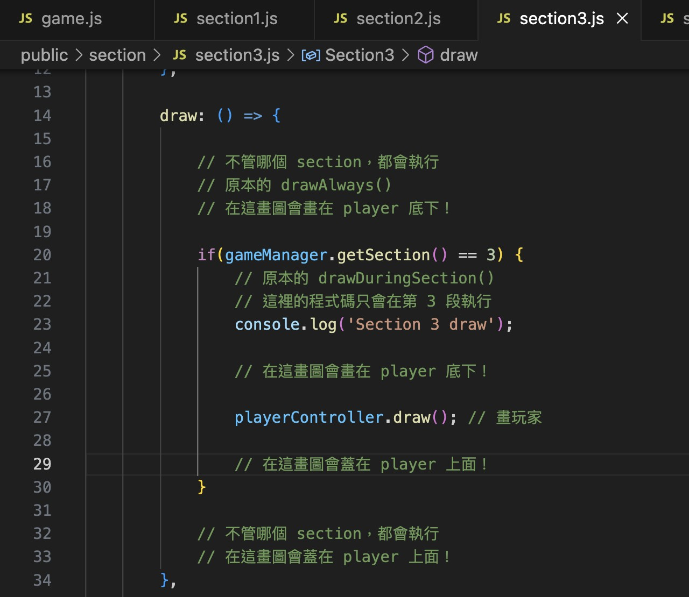

# 遊戲運行 & 基本元件 

### 封面
- 封面是 `start.js`

## 遊戲的運作
- 遊戲的本體在 `game.js`
- `game.js` 是個一般的 p5.js ，包含了 preload -> setup -> draw(loop)
- 因為我們遊戲有分 5 段，所以希望能將各個段落的 code 寫在對應的 section1.js , section2.js, section3.js ...中
- 因此 `game.js` 的 draw() 裡會做以下事情：
    -  呼叫**所有段落**的 `draw()`
        - 每個 draw() 裡面包含畫玩家的地方：
        ```js
        playerController.draw();
        ```
        - 每個 draw() 裡都有「進行到這個 section 時才做的事情」，跟「不論在哪個 section 都會執行」的
        

- `game.js` 還會畫遊戲的共用 UI （分數、任務等等）、背景的道路

### 寫扣的情境
- **如果要寫某一個段落的事情** -> 寫在對應的 section1 ~ 5.js
    - 每個 sectionX.js 可以看作是一個 p5.js 的 preload -> setup -> draw(有分兩種)
    - sectinoX.js 的 draw 有分兩種：
        - `if(gameManager.getSection() ==目前 section)`: 只有處在那個 section 時才 draw ：適合寫只限那個 section 的判斷邏輯
        - 其他： 不管 section 是多少，都會 draw：適合畫東西，不會因為 section 結束而消失
- **如果要寫與段落無關、貫穿整個遊戲的東西** -> 可以寫在 game.js
    - 例如會一直有車冒出來、有行人冒出來、或是其他 UI


### 遊戲的移動
- 是 player （藍色方塊）在移動（越往上 y 座標越小）
    - 由 game.js 裡的 `playerController` 控制了玩家的移動
    - 使用 p5play 的 camera 跟隨玩家(https://p5play.org/learn/camera.html)
        - `GameManager` 的 `cameraFollow()`
- `player` 可以拿到玩家的 sprite，進而取得玩家位置或速度
    - 因為 game.js 的 `let player = playerController.getPlayer()`


## 基本元件

### 跟畫圖有關  
- GameManager: 負責畫背景道路，初始化遊戲的畫布
- PlayerController: 負責畫玩家、控制玩家（藍色方塊）
- MainUIController: 負責畫最上面圖層的 UI，包含：分數、任務、警告等等
- SectionManager: 負責畫目前的段落
- section1-5.js: 定義了各個段落的 preload, onSectionStart（段落開始時呼叫一次）, draw（同 p5.js）, onSectionEnd（段落結束時呼叫一次）
    - **主要寫扣的地方！**

### 只跟資料/狀態有關，沒有畫圖
- EventManager: 負責管理事件，由寫扣的人自行控制事件的開始與結束，會負責依據成功或失敗加減分
    - 在 `eventData.js` 中定義事件和加減分
- PlayerData: 負責儲存玩家的分數與罰單

----

## 基本元件的各個 Functions
> 各個元件可能在開發時用到的 functions

### `GameManager`
管理背景、道路圖片、畫布、目前段落（1~5）

Functions:
- `getRoadXRange()`: 取得**只有馬路**的邊界，回傳左界 x 座標和右界的 x 座標
- `getSteetXRange()`: 取得**馬路 + 人行道**的邊界，回傳左界 x 座標和右界的 x 座標
- `getVisibleYRange()`: 取得目前畫面上下邊界，回傳上界 y 座標和下屆 y 座標

以下較少用：
- `getSection()`: 取得目前的段落編號（1 ~ 5）
- `setSection(newSection)`: 設定段落
- `cameraFollow(followPoint)` : 設定相機的跟隨位置

### `SectionManager`
管理 Section 的切換

#### `section/section1~5.js`
每個段落的邏輯，在某個段落發生的事情可以寫在對應的段落裡面

Functions:
- `preload`: 在 p5.js 的 preload 執行一次
- `onSectionStart`: Section 開始時觸發一次
- `draw`: 不論 section 是多少，都會重複執行
- `onSectionEnd`: Section 結束時觸發一次

### `MainUIController`
- 管理常駐的 UI
- 目前包含分數、任務、警告

### `EventManager`
- 用來管理事件（有自己的文件）
- 由寫扣的人自行控制事件的開始與結束
- 事件們的資料（ID, 分數）定義在 `data/eventData.js`

### `PlayerData`
- 管理玩家的分數、玩家的罰單

Functions:
- `addScore(changedScore)`: 加分
- `addTrafficTicket(title, amount)`: 加罰單

以下較少用：
- `getScore()`
- `onScoreChange(callback)`: 註冊一個分數更新時的 callback

### `PlayerController`
負責控制 player 以及 player 的 sprite

Functions:
- `getPlayer()`: 拿到 player 的 sprite，可以做碰撞偵測或是取得位置速度資訊等等
    - `game.js` 有 `let player = playerController.getPlayer()` 可以使用


---
## Demo 用物件

使用上述的 functions 的一些 demo 用物件

### `Walker`
- 用來 demo 行人
- 使用 gameManager 的道路邊界

### `Car`
- 用來 demo 對向的車子
- 使用 `playerData.addScore(-1)` 讓撞到時扣分

